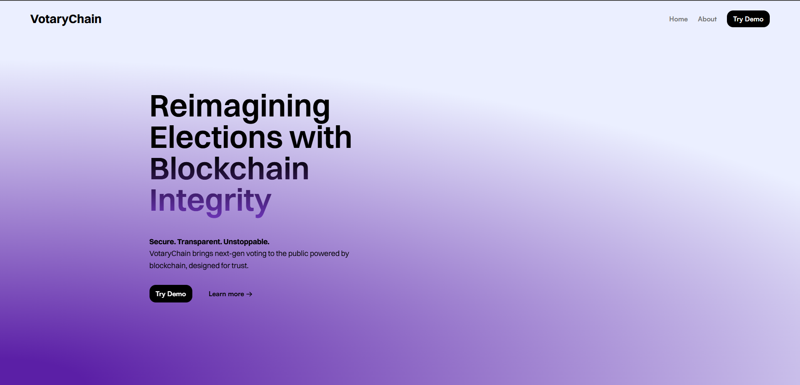

# VotaryChain – Secure Blockchain Voting System

**VotaryChain** is a web-based voting platform that leverages blockchain technology and elliptic curve cryptography (secp256k1) to ensure secure, tamper-resistant elections. Built with a custom blockchain and a user-friendly interface, VotaryChain allows voters to generate cryptographic key pairs, cast digitally signed votes, and verify results on a public ledger.





## 🔐 Features

- **Custom Blockchain**: SHA-256 powered ledger records immutable voting blocks
- **Elliptic Curve Cryptography**: secp256k1-based digital signatures for vote authenticity
- **RESTful API**: Node.js + Express backend handles vote submissions, key generation, and chain validation
- **Responsive Frontend**: HTML, CSS, and JavaScript interface to guide users through secure voting
- **Province-Based Finalization**: Votes are grouped by region to finalize blocks and prevent manipulation
- **Tamper Protection**: Signature verification prevents vote duplication and forgery
- **Real-time Validation**: Immediate verification of vote integrity and blockchain state

## 📦 Tech Stack

**Backend:**
- Node.js
- Express.js
- crypto-js (SHA-256 hashing)
- elliptic (secp256k1 cryptography)

**Frontend:**
- HTML5
- CSS3
- Vanilla JavaScript

**Security:**
- Elliptic Curve Digital Signature Algorithm (ECDSA)
- SHA-256 cryptographic hashing
- Public-private key cryptography

## 🏗️ Architecture

VotaryChain implements a custom blockchain with the following components:

- **Block Structure**: Each block contains vote data, timestamps, and cryptographic hashes
- **Digital Signatures**: Every vote is signed with the voter's private key
- **Chain Validation**: Continuous verification ensures blockchain integrity
- **API Endpoints**: RESTful services for vote submission and result retrieval

## 🚀 Getting Started

### Prerequisites

- Node.js (v14 or higher)
- npm package manager

### Installation

1. **Clone the repository**
   ```bash
   git clone https://github.com/yourusername/votarychain.git
   cd votarychain
   ```

2. **Install dependencies**
   ```bash
   npm install
   ```

3. **Start the server**
   ```bash
   node index.js
   ```

4. **Access the application**
   
   Navigate to `http://localhost:3000` in your web browser

## 📸 Screenshots

### Key Generation Interface


### Voting Interface


## 🔧 API Endpoints

| Method | Endpoint | Description |
|--------|----------|-------------|
| `GET` | `/api/keys` | Generate new cryptographic key pair |
| `POST` | `/api/vote` | Submit a digitally signed vote |
| `GET` | `/api/blockchain` | Retrieve current blockchain state |
| `GET` | `/api/results` | Get voting results by province |
| `POST` | `/api/validate` | Validate blockchain integrity |

## 🛡️ Security Features

- **Digital Signatures**: Each vote is cryptographically signed to ensure authenticity
- **Hash Chain Integrity**: SHA-256 linking prevents block tampering
- **Double Voting Prevention**: Signature verification blocks duplicate votes
- **Immutable Records**: Blockchain structure ensures vote permanency
- **Public Verification**: Anyone can validate the voting chain

## 🗳️ How It Works

1. **Key Generation**: Voters generate a unique secp256k1 key pair
2. **Vote Casting**: Votes are digitally signed with the private key
3. **Blockchain Recording**: Signed votes are added to the blockchain
4. **Verification**: Public keys verify vote authenticity
5. **Finalization**: Province-based grouping prevents manipulation

## 🧪 Testing

Run the test suite to verify system functionality:

```bash
npm test
```

## 📁 Project Structure

```
votarychain/
├── index.js              # Main server file
├── blockchain/           # Blockchain implementation
├── crypto/              # Cryptographic utilities
├── public/              # Frontend assets
│   ├── index.html       # Main interface
│   ├── styles.css       # Styling
│   └── script.js        # Client-side logic
├── routes/              # API route handlers
└── package.json         # Dependencies
```

## 🤝 Contributing

Contributions are welcome! Please feel free to submit pull requests or open issues for bugs and feature requests.

## 📄 License

This project is licensed under the MIT License - see the [LICENSE](LICENSE) file for details.

## 🙏 Acknowledgments

- Built with modern cryptographic standards (secp256k1)
- Inspired by blockchain voting research and democratic innovation
- Designed for transparency and security in digital elections

---

**Note**: This is a demonstration project for educational purposes. For production voting systems, additional security audits and compliance measures would be required.
